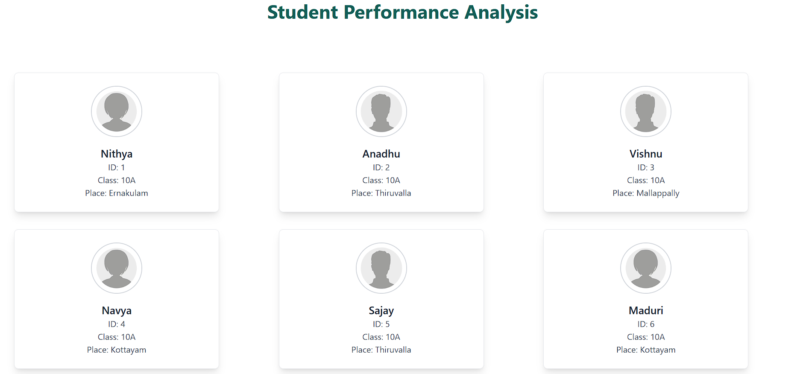
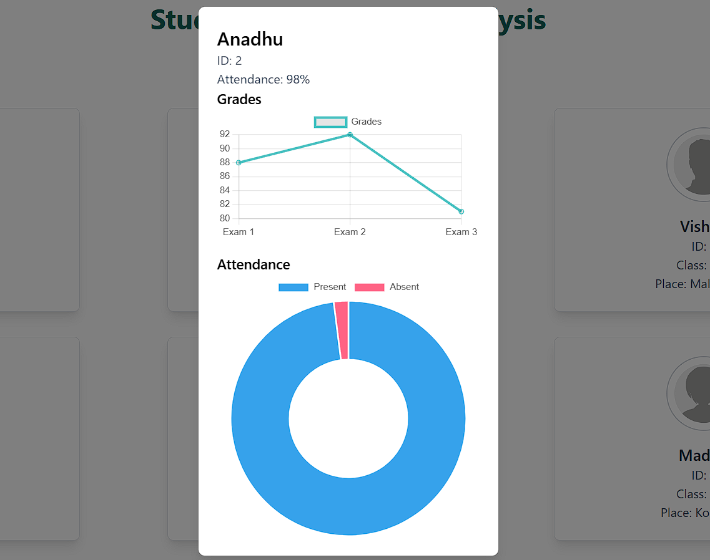

# **Student Performance Dashboard**

A React-based web application that displays student performance data in the form of modern, visually appealing cards. Clicking on a student's card opens a modal with detailed information and graphical representation of their performance.

---

## **Features**
- 📊 **Dynamic Cards**: Displays individual student information such as name, ID, class & place.
- ⚡**Build Tool**: Vite (for fast development and optimized builds)
- 📈 **Performance Graph**: Interactive modal showcasing graphical representation of attendance and grades.
- 🎨 **Modern UI**: Built with **TailwindCSS** for clean, responsive, and visually appealing design.
- ✨ **Interactive Modals**: Click on a card to view detailed student data.

---

## **Technologies Used**
- **Frontend**: React.js, TailwindCSS
- **Animations**: Framer Motion
- **Data Management**: State handling with React's `useState` hook
- **Graph Representation**: (Include graph library name, e.g., Chart.js, if used)

---

## **Getting Started**


### **Installation**
1. Create root folder:
   ```bash
   student_card_app
   ```
2. Create the folder:
   ```bash
   frontend
   ```
2. Navigate to the project directory:
   ```bash
   cd frontend
   ```
3. Install dependencies:
   ```bash
   npm install
   ```

### **Run the Project**
Start the development server:
```bash
npm run dev
```

---

## **Project Structure**
```
src/
│
├── components/
│   ├── Cards.jsx         # Renders individual student cards
│   ├── Modal.jsx         # Displays detailed student info in a modal
│   └── Graph.jsx         # Renders performance graphs for students
│
├── data/
│   └── StudentData.js    # Contains sample student data
│
├── App.jsx               # Main application file
├── index.css             # TailwindCSS configurations
└── main.jsx              # Renders the app to the DOM
```

---

## **How It Works**

1. **Cards Component**:
   - Displays student information (name, grades, etc.).
   - Calls the `handleCardClick` function when clicked to display the modal.
2. **Modal Component**:
   - Displays detailed information about the selected student.
   - Includes a close button to dismiss the modal.
3. **State Management**:
   - The `selectedStudent` state tracks which student's data is displayed in the modal.


---


### **Screenshots**


